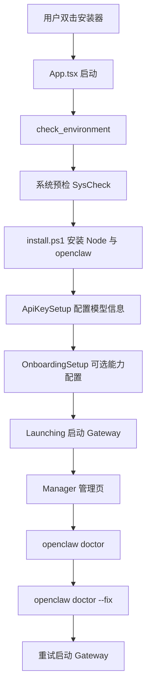
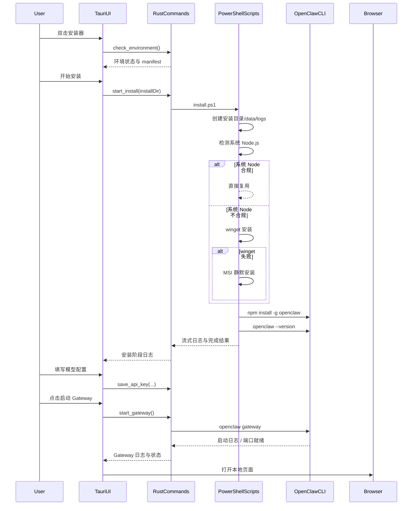

# OpenClaw Quick Installer for Windows

面向 Windows 用户的 OpenClaw 图形化安装器。

这个仓库不是在“重新发明一个 OpenClaw”，而是在做一件更克制也更有价值的事情：把 OpenClaw 官方 CLI、本地运行模型、Windows 环境差异、安装失败排障、首次配置体验，收束成一个普通用户可以双击使用、维护者可以放心审阅、开发者可以持续演进的桌面安装器。

## 这份 README 的目标

这不是一份简单的“怎么运行项目”的说明，而是一份维护者文档。

它要回答 5 个最核心的问题：

1. 这个安装器到底负责什么，不负责什么。
2. 我们复用了 OpenClaw 官方哪些能力。
3. 我们为了 Windows 用户额外补了哪些价值。
4. 整个安装、启动、诊断、修复链路的真实代码路径是什么。
5. 为什么这个项目在逻辑、文件职责、安全边界上是可维护、可审计、可交付的。

---

## 一句话原则

`OpenClaw 负责 AI 能力与官方命令语义，我们负责 Windows 图形化编排、系统适配、错误可见性、日志落盘和用户体验。`

换句话说：

- 不伪造 OpenClaw 的核心能力。
- 不隐藏关键执行步骤。
- 不让用户面对黑盒命令行。
- 不让维护者在“到底是谁写坏了配置、谁启动了网关、失败信息去哪了”这种问题里迷路。

---

## 整体架构

| 层级 | 技术 | 职责 |
| --- | --- | --- |
| 桌面壳 | Tauri 2 | 提供 Windows 原生窗口、命令桥接、资源打包 |
| 前端 UI | React + TypeScript + Tailwind | 安装向导、日志展示、状态管理、错误交互 |
| 后端命令层 | Rust | 负责命令注册、进程管理、结构化结果、日志落盘、状态持久化 |
| 系统脚本层 | PowerShell | 执行 Windows 安装细节、兼容系统环境差异 |
| 官方能力层 | OpenClaw CLI | `openclaw` 本身的安装、版本校验、诊断、修复、网关、配置能力 |

---

## 全流程总览



如果从维护者视角再压缩一句：

`前端负责向导与状态，Rust 负责命令桥与进程控制，PowerShell 负责 Windows 落地，OpenClaw CLI 负责官方语义。`

---

## 我们复用了 OpenClaw 官方哪些内容

这是整个项目最重要的边界说明。

### 1. OpenClaw CLI 本体

安装器最终安装的不是“魔改版客户端”，而是全局 `openclaw` CLI。

当前仓库真实使用到的官方命令能力包括：

- `openclaw --version`
- `openclaw` 全局可执行发现与校验
- `openclaw doctor`
- `openclaw doctor --fix`
- `openclaw gateway` 启动能力
- `openclaw dashboard`（优先用于打开带认证上下文的控制台）
- `openclaw onboard`（用于可选能力引导）

### 2. OpenClaw 默认用户配置目录

OpenClaw 官方配置基线在用户主目录下：

- `~/.openclaw/`
- `~/.openclaw/openclaw.json`

这意味着安装器不应该把配置当成“自己专属的数据格式”，而应始终把 OpenClaw 官方目录视为长期真源。

### 3. OpenClaw 自诊断与修复语义

当用户启动 Gateway 失败时，真正有权威性的诊断者不是安装器，而是 OpenClaw 官方命令：

- `openclaw doctor`
- `openclaw doctor --fix`

安装器的职责，是把这两个命令从“黑盒终端行为”变成：

- 用户可点击
- 结果可阅读
- 日志可查看
- 修复后可继续重试

### 4. OpenClaw 网关本地运行模型

最终用户访问的是本地 OpenClaw 页面，本地端口为主，浏览器作为展示层。安装器不做任何中转代理，不建立云端托管链路，不接管 AI 请求本身。

---

## 我们额外增加了哪些内容

如果说 OpenClaw 提供的是能力内核，那么本仓库做的是 Windows 场景下的“可靠包装层”。

### 1. Windows 友好的 GUI 安装向导

用户不需要手敲命令，不需要理解 Node、npm、PATH、PowerShell、WebView2、端口占用这些概念，也不需要先学一遍 OpenClaw 文档。

界面将整个流程拆成 5 步：

1. 系统预检
2. 安装 OpenClaw
3. 配置 AI 模型
4. 可选能力配置（onboard）
5. 启动 Gateway

### 2. Node.js 自动检测与自动安装

OpenClaw 是 Node 生态下的 CLI，普通用户最常见的失败点就是没有 Node，或者 Node 版本不对。

安装器做了三层处理：

1. 先检测系统是否已有 `node.exe`，且主版本是否 `>= 18`
2. 有合规 Node 则直接复用，跳过安装
3. 没有则优先尝试 `winget`，失败后再降级到 MSI 静默安装

这让“用户本机没有开发环境”不再是阻断条件。

### 3. Windows 目录与权限适配

安装器额外处理了：

- 默认安装目录推导
- 安装目录创建
- 日志目录创建
- 管理员权限检测与提权入口
- 桌面快捷方式创建
- 原生窗口控制

### 4. 进度可视化与日志实时展示

用户不是被动等待，而是可以看到：

- 当前执行阶段
- 安装脚本输出
- Gateway 启动日志
- 诊断结果
- 修复结果

这对排障和信任感都非常关键。

### 5. 结构化错误与日志落盘

我们不是只把错误打印到控制台，而是把失败封装成结构化结果：

- `code`
- `message`
- `hint`
- `command`
- `exit_code`
- `log_path`
- `retriable`

同时将命令输出写入：

- `~/.openclaw/installer-logs/`
- `<install_dir>/logs/`

这样维护者可以复盘，用户也可以反馈。

### 6. 失败后的“可操作修复”

最重要的亮点不是“我们永不失败”，而是“失败后用户仍有路可走”。

我们额外提供了：

- 失败详情展示
- 一键诊断
- 一键修复
- 打开日志目录
- 复制诊断信息
- 重试启动

这让“已停止”不再是终点，而是下一步动作的起点。

---

## 真实代码路径梳理

这一节是给维护者看的，请把它当成代码地图。

## 1. 应用入口与路由决策

核心文件：

- `openclaw_installer_windows/src/App.tsx`

职责：

- 启动应用
- 监听安装日志事件
- 调用 `check_environment`
- 判断进入安装向导还是 Manager 页面
- 维护全局日志与 Gateway 状态

启动逻辑大致是：

1. Tauri 启动前端
2. 前端调用 Rust 命令 `check_environment`
3. 判断：
   - 是否已安装 `openclaw`
   - 是否存在配置
   - manifest 是否完整
4. 决定进入：
   - `wizard`
   - `manager`
   - 或直接跳到 `launching`

## 2. 系统预检

核心文件：

- `openclaw_installer_windows/src/pages/SysCheck.tsx`
- `openclaw_installer_windows/src-tauri/src/commands.rs`

职责：

- 检测管理员权限
- 检测 WebView2
- 检测磁盘空间
- 检测推荐安装目录
- 检测网络与端口

这里的价值不在于“检查很多项”，而在于把用户真正可能踩坑的 Windows 前置条件尽量提前暴露。

## 3. 安装流程

核心文件：

- `openclaw_installer_windows/src/pages/Installing.tsx`
- `openclaw_installer_windows/src-tauri/src/commands.rs`
- `openclaw_installer_windows/src-tauri/scripts/install.ps1`

真实链路：

1. 前端调用 `start_install`
2. Rust 通过 `run_ps_script_streaming_sync` 执行 `install.ps1`
3. PowerShell 完成以下步骤：
   - 创建安装目录、`data`、`logs`
   - 检测系统 Node.js
   - Node 不满足时使用 `winget` 或 MSI 静默安装
   - 检测是否已安装 `openclaw`
   - 未安装时执行 `npm install -g openclaw`
   - 执行 `openclaw --version` 验证
   - 写入 `install-info.json`

这里复用的官方能力是：

- `openclaw` CLI 本体
- `openclaw --version`

这里是我们额外补的内容：

- Windows 兼容安装链路
- npm 镜像优化
- 进度事件上报
- 安装日志 UI 化

## 4. AI 配置流程

核心文件：

- `openclaw_installer_windows/src/pages/ApiKeySetup.tsx`
- `openclaw_installer_windows/src-tauri/src/commands.rs`

当前仓库会在此阶段执行：

- API Key 连通性验证
- 配置写入

需要维护者特别注意的一点：

当前代码里依然存在安装器侧主动写入 `openclaw.json` 的历史逻辑，这是一个明确的维护重点和后续收敛方向。长期原则应是：

- 以 OpenClaw 官方配置语义为准
- 安装器只做最小必要引导
- 避免自定义 schema 漂移

## 5. Gateway 启动流程

核心文件：

- `openclaw_installer_windows/src/pages/Launching.tsx`
- `openclaw_installer_windows/src/pages/Manager.tsx`
- `openclaw_installer_windows/src-tauri/src/commands.rs`
- `openclaw_installer_windows/src-tauri/scripts/gateway.ps1`（当前主要用于停止逻辑）

当前实现已经收敛为单一路径编排：

- `Launching.tsx` 调用 `start_gateway`，内部走 `run_gateway_start`
- `Manager.tsx` 调用 `start_gateway_bg`，内部同样走 `run_gateway_start`
- 两个入口最终都由 Rust 统一拉起 `openclaw gateway --port ... --allow-unconfigured`
- Dashboard 打开优先走 `openclaw dashboard`，失败时回退到本地 URL

维护者需要明确：

- Gateway 启动主路径已统一在 Rust 命令层
- `gateway.ps1` 不再是主启动路径
- 失败诊断仍优先依赖 `openclaw doctor` / `openclaw doctor --fix`

## 6. 失败诊断与修复流程

核心文件：

- `openclaw_installer_windows/src/pages/Launching.tsx`
- `openclaw_installer_windows/src/pages/Manager.tsx`
- `openclaw_installer_windows/src-tauri/src/commands.rs`

当前安装器已支持：

- `detect_cli_capabilities`
- `run_doctor`
- `run_doctor_fix`
- `get_log_directory`

也就是说，失败后的处理不是“告诉用户去看终端”，而是：

1. 展示错误消息
2. 展示建议提示
3. 允许执行 `openclaw doctor`
4. 允许执行 `openclaw doctor --fix`
5. 允许打开日志目录
6. 允许复制诊断信息

这就是本项目在工程价值上的一条分水岭：

`安装器不是只负责成功路径，也负责失败路径的可恢复性。`

---

## 关键文件职责清单

### 前端

- `openclaw_installer_windows/src/App.tsx`
  - 应用入口、路由判断、全局日志状态
- `openclaw_installer_windows/src/pages/SysCheck.tsx`
  - 系统预检 UI
- `openclaw_installer_windows/src/pages/Installing.tsx`
  - 安装阶段 UI 与进度展示
- `openclaw_installer_windows/src/pages/ApiKeySetup.tsx`
  - 模型提供商与 API Key 配置
- `openclaw_installer_windows/src/pages/Launching.tsx`
  - 启动 Gateway、失败诊断、修复与重试
- `openclaw_installer_windows/src/pages/Manager.tsx`
  - 安装后管理界面，包含启动、停止、重启、诊断、查看日志
- `openclaw_installer_windows/src/components/LogScroller.tsx`
  - 日志滚动展示
- `openclaw_installer_windows/src/types.ts`
  - manifest、日志、结构化错误、doctor 结果等前端类型

### Rust

- `openclaw_installer_windows/src-tauri/src/lib.rs`
  - Tauri 应用初始化与命令注册
- `openclaw_installer_windows/src-tauri/src/commands.rs`
  - 所有核心后端命令
  - manifest 读写
  - OpenClaw 可执行发现
  - PATH 刷新
  - 命令执行与结构化结果
  - 日志落盘
  - Gateway 进程管理

### PowerShell

- `openclaw_installer_windows/src-tauri/scripts/install.ps1`
  - Node 检测/安装
  - `npm install -g openclaw`
  - 安装信息写入
- `openclaw_installer_windows/src-tauri/scripts/gateway.ps1`
  - 后台 Gateway 启停
  - stdout/stderr 日志落盘
  - 健康检查

---

## 安全与合规边界

维护者最应该放心的，不是“这个项目功能很多”，而是“这个项目的边界是清楚的”。

### 1. 本地优先

- 用户核心数据不经过本项目云端中转
- 本项目不托管用户模型调用
- 本项目的主要职责是本地安装、启动、诊断与管理

### 2. 目录边界清晰

当前会涉及以下目录：

- 安装目录：通常为 `%LOCALAPPDATA%\\OpenClaw`
- OpenClaw 官方配置目录：`%USERPROFILE%\\.openclaw`
- 安装器日志目录：`%USERPROFILE%\\.openclaw\\installer-logs`
- 运行日志目录：`<install_dir>\\logs`

### 3. 可审计

关键命令有日志。

关键错误有结构化结果。

关键状态有 manifest。

关键脚本都在仓库中明文可读。

这意味着维护者可以回答：

- 安装器做了什么
- 什么时候做的
- 失败在哪里
- 用户应该如何继续

### 4. 权限使用有边界

管理员权限只在必要时请求，用于 Windows 级别安装与环境落地，不用于越权接管用户系统。

### 5. 对 OpenClaw 官方真源保持敬畏

维护时必须坚持一条原则：

`凡是 OpenClaw 官方命令可以完成的能力，优先通过官方命令完成。`

这样才能降低：

- 自定义配置 schema 漂移风险
- 非官方启动参数兼容风险
- 版本升级后行为变化风险

---

## 维护建议

如果你是后续维护者，请优先守住下面几条：

1. 不要把安装器写成“第二个 OpenClaw”。
2. 不要随意扩张 `openclaw.json` 的自定义字段。
3. 不要增加无法解释的隐藏行为。
4. 不要让错误只留在控制台里。
5. 不要让前端状态与后端真实状态脱节。
6. 优先收敛双启动路径，减少 Rust 与 PowerShell 的参数分叉。
7. 所有新增流程都要回答：这一步是官方能力，还是安装器增强层。

---

## 建议的维护检查清单

每次改动安装/启动链路前，请先检查：

1. 用户已有 Node 时，是否仍会被重复安装。
2. `openclaw` 已存在时，是否仍会重复执行 npm 全局安装。
3. 配置写入路径是否仍与 OpenClaw 官方目录一致。
4. Launching 与 Manager 是否仍然展示同样级别的错误可见性。
5. 失败后是否仍可执行 `doctor`、`doctor --fix`、查看日志、重试。
6. 是否引入了新的“只有成功路径，没有失败路径”的 UI。
7. README 是否仍能准确描述真实代码行为。

---

## 新用户安装时序图

这一节给维护者和测试同学一个“从用户点击到页面可用”的标准观察模型。



维护时如果发现某一步“逻辑写在别处、文档没体现、日志也没覆盖”，就说明这个流程已经开始失去可维护性了。

---

## 故障排查矩阵

这一节不是给用户看的，而是给维护者、测试同学、issue 分诊者看的。

### 场景 1：系统预检不通过

| 现象 | 常见原因 | 优先检查位置 | 建议动作 |
| --- | --- | --- | --- |
| 管理员权限未通过 | 当前进程无提权 | `SysCheck.tsx`、`commands.rs` 中管理员检测 | 使用提权入口重新启动安装器 |
| WebView2 检测异常 | 系统缺少 Runtime 或注册表识别异常 | `commands.rs` 中 `check_webview2()` | 在 README/界面中提示用户安装 WebView2 |
| 磁盘空间或路径异常 | 目录不可写、路径含中文/空格、目标盘空间不足 | `commands.rs` 中路径检查与磁盘检查 | 更换安装目录，优先纯英文路径 |

### 场景 2：安装 Node 失败

| 现象 | 常见原因 | 优先检查位置 | 建议动作 |
| --- | --- | --- | --- |
| `winget` 不可用 | 系统环境缺失、商店组件异常 | `install.ps1` | 自动降级 MSI，必要时让用户手动安装 Node |
| MSI 下载失败 | 网络异常、镜像失效 | `install.ps1`、`<install_dir>/logs` | 检查下载地址，保留多源下载策略 |
| Node 安装后仍不可识别 | PATH 未刷新、安装未完成 | `install.ps1` 中 `Refresh-Path` | 重开安装器再试，并记录 `node --version` 输出 |

### 场景 3：OpenClaw CLI 安装失败

| 现象 | 常见原因 | 优先检查位置 | 建议动作 |
| --- | --- | --- | --- |
| `npm install -g openclaw` 退出码非 0 | 网络、权限、npm 本身异常 | `install.ps1`、`npm-install-err.log` | 展示 stderr，优先复用镜像并提示重试 |
| 已有 openclaw 仍重复安装 | CLI 检测逻辑不稳 | `install.ps1` 中已安装判断 | 先修检测逻辑，再考虑安装逻辑 |
| `openclaw --version` 失败 | PATH、npm prefix、cmd 发现路径问题 | `commands.rs` 中 `find_openclaw_cmd()` | 优先修命令发现，不要盲目重装 |

### 场景 4：Gateway 启动失败

| 现象 | 常见原因 | 优先检查位置 | 建议动作 |
| --- | --- | --- | --- |
| UI 仅显示“已停止” | 前端未收到结构化错误 | `Launching.tsx`、`Manager.tsx`、`commands.rs` | 保证错误可见、建议可见、日志可见 |
| 端口未就绪 | OpenClaw 进程提前退出、端口占用 | `gateway.ps1`、`commands.rs`、`<install_dir>/logs` | 先看 stderr，再决定是否执行 `doctor --fix` |
| 页面打开但对话不可用 | API Key、provider、auth profile 问题 | `~/.openclaw/openclaw.json`、doctor 输出 | 优先依赖 `openclaw doctor` 结论，不要猜测 schema |

### 场景 5：配置文件异常

| 现象 | 常见原因 | 优先检查位置 | 建议动作 |
| --- | --- | --- | --- |
| `openclaw.json` key 不兼容 | 安装器历史写入逻辑与官方 schema 漂移 | `commands.rs` 中配置写入逻辑 | 收敛到官方命令优先，减少自定义字段 |
| 配置路径混乱 | 安装目录 data 与 `~/.openclaw` 语义分叉 | `gateway.ps1`、`commands.rs` | 明确唯一真源，避免 A 写 B 读 |
| doctor 能修复但 UI 没入口 | 编排层遗漏 | `Launching.tsx`、`Manager.tsx` | 把诊断/修复入口前置，不要让用户自行找命令 |

### 分诊优先顺序

遇到线上问题时，建议按这个顺序排：

1. 先看用户看到的 UI 报错。
2. 再看 `~/.openclaw/installer-logs/`。
3. 再看 `<install_dir>/logs/`。
4. 再看 `openclaw doctor` 输出。
5. 最后才去猜配置或修改代码。

---

## Windows 用户常见问题（自助修复）

这一节是给普通 Windows 用户看的，不要求理解全部内部实现。

### 1) 需要先手动执行 `Set-ExecutionPolicy RemoteSigned` 吗？

通常不需要。

当前安装器执行脚本时使用的是 `-Command + scriptblock` 路径，默认不会因为 `-File` 的执行策略校验被直接拦截。只有在企业组策略或安全软件强约束时，才可能需要手工放宽当前用户策略。

可选兜底命令（仅当前用户）：

```powershell
Set-ExecutionPolicy -ExecutionPolicy RemoteSigned -Scope CurrentUser
```

执行后输入 `Y` 确认，然后重新打开安装器。

### 2) 安装显示成功，但终端里 `openclaw` 提示找不到命令

这是 Windows 上最常见的 PATH 刷新问题之一，不是必须重装。

建议顺序：

1. 先关闭并重新打开安装器或终端（触发 PATH 刷新）。
2. 执行 `npm config get prefix` 查看 npm 全局前缀目录。
3. 确认 `%APPDATA%\\npm` 或 prefix 目录在 PATH 可发现范围。
4. 仍失败时，查看安装器日志目录：`%USERPROFILE%\\.openclaw\\installer-logs`。

### 3) `npm install -g openclaw` 报权限错误（EACCES / EPERM）

在本项目的 Windows 语境里，优先做这三件事：

1. 用管理员权限运行安装器（先走系统预检里的提权入口）。
2. 确认 Node.js 已正确安装并能执行 `node --version`。
3. 查看 `npm-install-err.log` 的真实 stderr，再决定是否重试。

不建议在 Windows 安装器场景优先套用 Unix 风格的 `.npm-global` 改造方案。

### 4) Gateway 启动被阻止 / 提示模式或配置异常

优先在安装器 UI 中执行：

1. 点击“诊断问题”（`openclaw doctor`）
2. 点击“一键修复”（`openclaw doctor --fix`）
3. 点击“重新启动”

命令行兜底方案：

```powershell
openclaw config set gateway.mode local
openclaw doctor --fix
openclaw gateway --port 18789 --allow-unconfigured
```

### 5) 已配置 API Key 仍提示 `No API key found`

优先判断为配置/agent 认证目录状态异常，而不是“Key 一定错了”。

建议顺序：

1. 在安装器中执行“诊断问题”和“一键修复”。
2. 检查 `~/.openclaw/openclaw.json` 是否仍包含有效的 `models.providers`。
3. 如果你有多 agent 场景，继续检查 agent 目录下 auth profile 是否与当前 agent 对齐。

### 6) Dashboard 提示认证失败次数过多（too many failed authentication attempts）

这通常是浏览器缓存了旧 token 或旧认证状态。

建议顺序：

1. 先停止并重启 Gateway。
2. 用浏览器无痕窗口重新打开 Dashboard / Chat。
3. 仍失败时，执行 `openclaw doctor` 并附带日志反馈。

---

## 发布打包与验收 SOP

这一节用于约束“我们什么时候可以放心发版”。

### A. 发布前检查

发布前至少完成以下检查：

1. `npm run build` 成功。
2. `cargo build --release` 成功。
3. 安装向导 4 步在本地原生窗口里可走通。
4. 新用户场景：无 Node、无 openclaw、无配置。
5. 升级用户场景：已有 openclaw、已有 `~/.openclaw` 配置。
6. 故障场景：人为制造配置异常后，`doctor` 和 `doctor --fix` 有可见结果。
7. Manager 页能真正启动、停止、重启、查看日志。

### B. 发布产物检查

发布时至少确认：

1. 应用图标正确。
2. 窗口控制按钮可用。
3. 桌面快捷方式图标正确。
4. 首次启动与二次启动逻辑符合预期。
5. README 与当前真实行为一致。

### C. 推荐的人工验收脚本

建议每个版本至少人工走这 3 组：

#### 1. 全新安装

1. 清理旧的安装目录与 `~/.openclaw`。
2. 启动安装器。
3. 完成系统预检。
4. 安装 Node / openclaw。
5. 填写模型配置。
6. 启动 Gateway。
7. 确认浏览器页面可打开。

#### 2. 已安装用户再次启动

1. 保留 `openclaw` 与配置。
2. 再次打开安装器。
3. 确认进入 Manager 或快速启动链路。
4. 验证停止、重启、打开日志、打开配置文件。

#### 3. 故障恢复

1. 人为破坏配置或占用端口。
2. 启动 Gateway。
3. 确认 UI 展示失败原因。
4. 点击诊断。
5. 点击修复。
6. 确认可以继续重试。

### D. 不允许直接发版的情况

有以下任一情况，不建议发版：

1. README 已经过时。
2. 失败场景只能在控制台看到错误。
3. 网关启动路径存在新分叉但没有文档说明。
4. 配置文件写入逻辑发生变化但没有明确说明与回归验证。
5. 本地能跑，现网用户无法复现验证路径。

---

## 维护者红线与代码评审准则

这是项目最重要的长期约束。

### 红线 1：不要把 OpenClaw 官方能力硬编码成安装器私有逻辑

如果某个能力官方命令已经提供，就优先调用官方命令，不要自己仿写一个“看起来差不多”的实现。

### 红线 2：不要偷偷改配置 schema

任何对 `openclaw.json` 的主动写入，都必须先回答：

1. 这是官方推荐写法吗？
2. 这个 key 是长期稳定的吗？
3. 如果 OpenClaw 升级，这里会不会漂移？

答不清楚，就不要写。

### 红线 3：不要引入新的黑盒步骤

所有关键操作都应该至少满足两件事：

1. 用户在 UI 上能感知。
2. 维护者在日志里能追溯。

### 红线 4：不要只优化成功路径

每次新增功能时，都要问：

- 它失败时用户看到什么？
- 维护者能从哪里定位？
- 用户下一步可以点什么？

### 红线 5：不要让脚本层和 Rust 层互相打架

如果 Rust 和 PowerShell 同时维护一份类似逻辑，就必须文档化两者的职责，否则后续必然漂移。

### 推荐的代码评审问题

每次 review 安装器相关改动时，建议至少问这 8 个问题：

1. 这一步是 OpenClaw 官方能力，还是安装器增强层？
2. 失败时是否有结构化错误？
3. 是否有日志落盘？
4. 是否影响已有用户的配置文件？
5. 是否改变了配置真源或目录边界？
6. 是否新增了新的启动路径分叉？
7. 是否影响二次启动或升级用户？
8. README 是否已经同步更新？

---

## 本地开发

### 环境准备

- Node.js 18+
- Rust stable
- VS Build Tools 2022（勾选“使用 C++ 的桌面开发”）
- WebView2 Runtime

### 安装依赖

```powershell
cd openclaw_installer_windows
npm install
```

### 前端预览

```powershell
cd openclaw_installer_windows
npm run dev
```

注意：

浏览器模式主要用于前端 UI 联调，不等价于完整原生安装链路。

### Tauri 原生开发

```powershell
cd openclaw_installer_windows
npm run tauri dev
```

### 构建发布版

```powershell
cd openclaw_installer_windows
npm run build
cd src-tauri
cargo build --release
```

如果需要完整安装包，再走 NSIS 打包链路。

---

## 给使用者的话

这个项目的初心，从来不是“炫技做一个桌面壳”，而是认真解决 OpenClaw 在 Windows 上落地时最真实的阻力：

- 用户不会装 Node
- 用户看不懂命令行
- 用户不知道配置写到哪里
- 用户遇到失败时没有下一步
- 开发者维护时不知道哪段逻辑才是主路径

所以我们做的每一层封装，都应该服务于同一个目标：

让普通用户少踩坑，让维护者少猜谜，让 OpenClaw 的官方能力在 Windows 上被更稳、更清晰、更值得信任地交付出来。

---

## License

MIT
