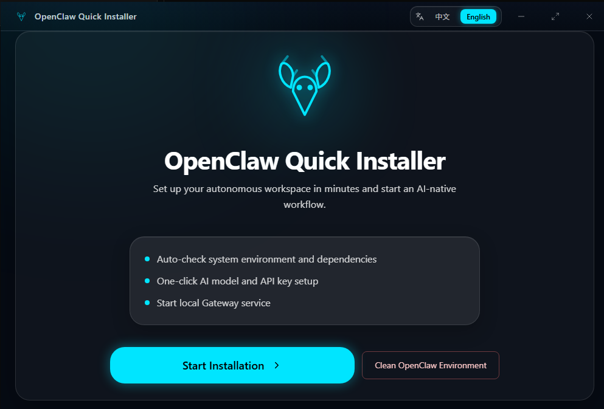
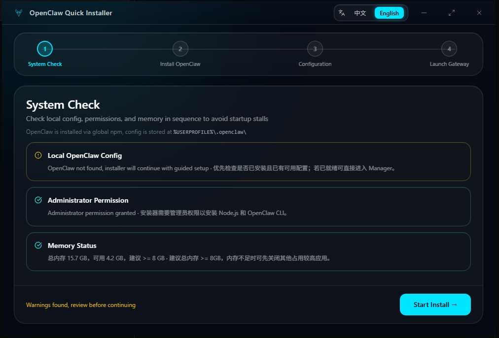
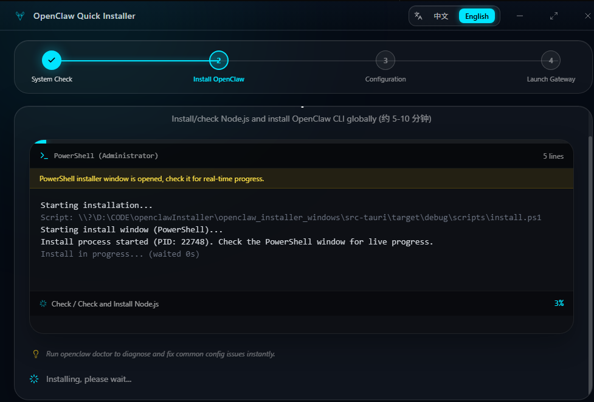
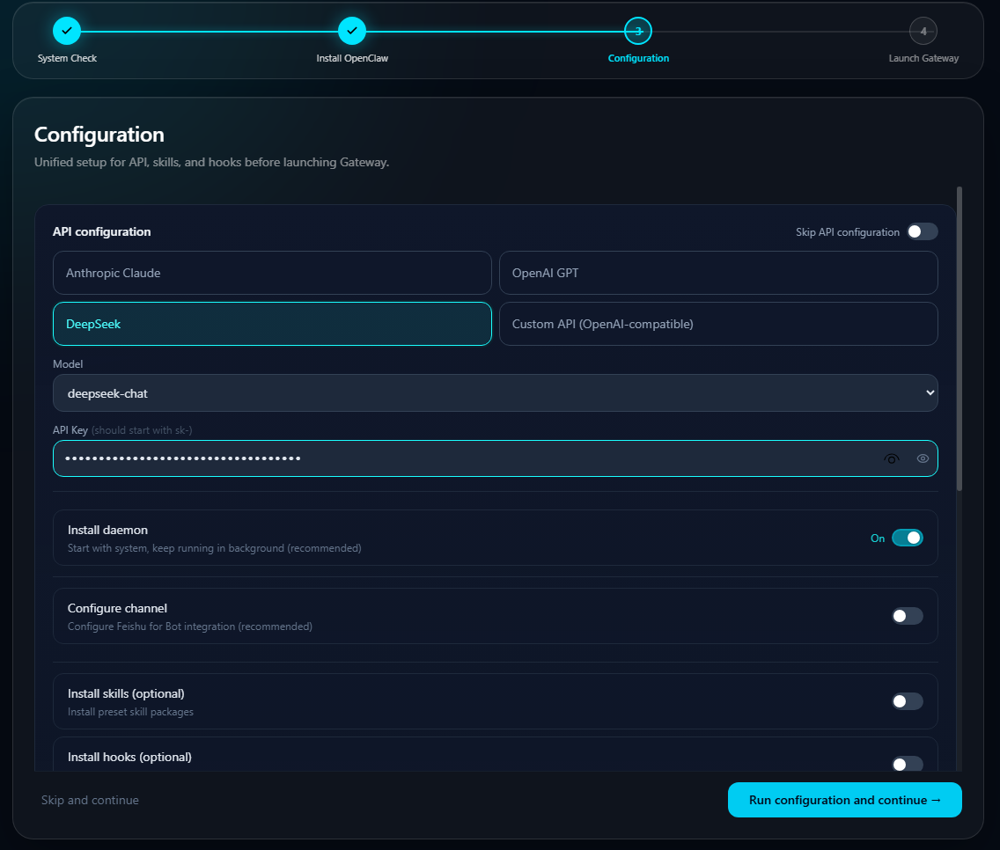
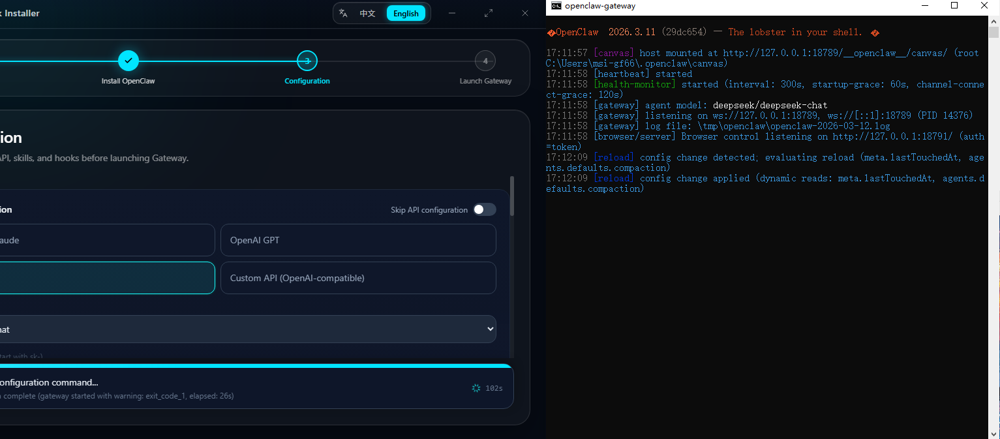
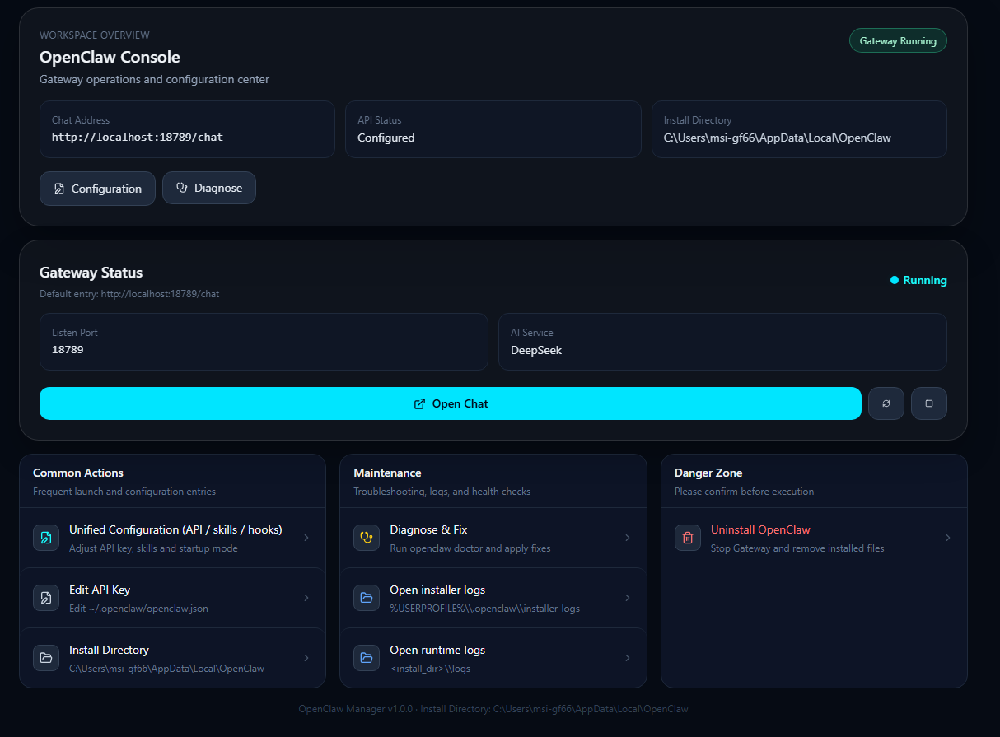

# 🦞 OpenClaw Windows Quick Installer

> **让 AI Agent 像安装游戏一样简单 | 专为 Windows 用户打造的 OpenClaw 一键部署与管理工具**
> 

---

## 💡 为什么选择本工具？

部署 OpenClaw AI 框架通常需要面对复杂的 Node.js 环境、Docker 配置和环境变量。**OpenClaw 一键安装器** 将这些痛苦化于无形：

| 维度 | 传统手动部署 | OpenClaw 一键安装器 |
| :--- | :--- | :--- |
| **部署耗时** | 60+ 分钟（易卡在环境报错） | **< 5 分钟 (全自动流程)** |
| **操作门槛** | 熟悉 PowerShell/Docker 命令 | **零基础图形化点击** |
| **配置管理** | 手写 YAML 配置文件 | **可视化表单与连接验证** |
| **维护成本** | 手动查进程、翻目录看日志 | **一键启动/停止，实时监控** |

---

## 🛡️ 安全与透明度声明

由于本项目尚未申请付费的数字签名，且涉及环境修改（如提权、写环境变量），部分引擎可能会出现误报。
* **VirusTotal 跑分：** [点击查看在线报告](https://www.virustotal.com/gui/file/1b97f52a5c25897ee126a541554ef94e0b13c7fb26254974e5e336d163f6fd93/detection ) 
* **安全承诺：** 代码完全开源，所有安装行为均在唤起的原生 PowerShell 窗口中公开展示，无任何后门或恶意代码。
* **误报说明：** Bkav Pro 或 Trapmine 提示的 `AIDetectMalware` 属于典型的启发式虚警，请放心使用。

---

## ✨ 核心功能

- **🚀 零基础上手**：环境预检、Node.js 安装、CLI 部署全自动完成。
- **🖥️ 可视化管理**：带 GUI 界面，一键控制 Gateway 服务的启停。
- **⚙️ 引导式配置**：支持 Anthropic, OpenAI, DeepSeek 等主流模型及飞书机器人一键配置。
- **🔍 智能诊断**：内置端口冲突检测与日志查看工具，快速排查运行异常。
- **🧹 优雅卸载**：提供“一键卸载”功能，干净清理环境，支持二次确认防止误删。

---

## 🚀 极速安装指引

安装器将通过以下直观向导引导您开启 AI 助手之旅：

### 1. 欢迎与预检
首先进入欢迎页，系统会自动进行管理员权限、内存（推荐 ≥8GB）及网络联通性检查，确保安装万无一失。

### 2. 一键自动化部署
自动下载并部署 OpenClaw 运行环境。安装过程会唤起 PowerShell 窗口预览进度，让每一步都清晰可见。

### 3. 可视化参数配置
无需修改配置文件！直接在 UI 中填写飞书信息及模型 API Key，并支持一键连接验证。

### 4. 启动与运行
确认配置后，系统会自动启动 Gateway。保持弹出的网关窗口开启，即可开始使用 OpenClaw。

---

## 🛠️ 日常管理与维护

若之前已完成安装，再次打开将直接进入**配置/管理页面**。您可以随时修改模型参数、查看实时日志或诊断系统状态。

---

## 🚧 路线图 (Roadmap)

- [ ] 🎨 **UI/UX 全面重构**：引入暗黑模式与更丝滑的交互体验。
- [ ] 📦 **插件超市**：支持 Skills 和 Hooks 库的在线搜索与一键扩展。
- [ ] ⚡ **模型市场**：增加对更多本地及在线模型服务商的预设支持。
- [ ] 📈 **自动更新**：安装器本身的一键静默升级功能。

---

## 💬 反馈与支持

- **提交 Issue**：遇到任何“未响应”或安装失败，请点击界面中的“日志查看”并提交 Issue。
- **开源协议**：本项目基于 [MIT License](./LICENSE) 开源。

---
*让 AI Agent 的力量触手可及。如果本项目对你有帮助，请给一个 **Star** ⭐️ 支持我们！*
