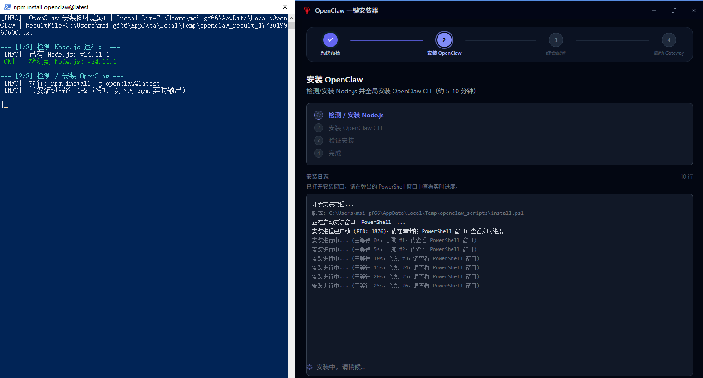
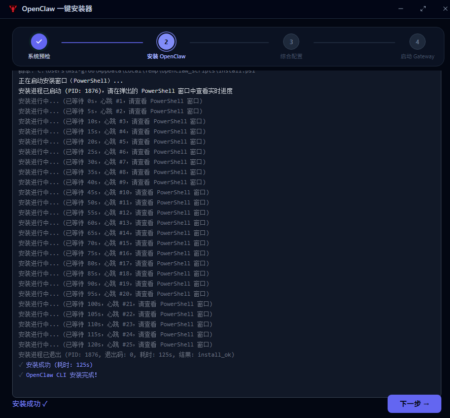
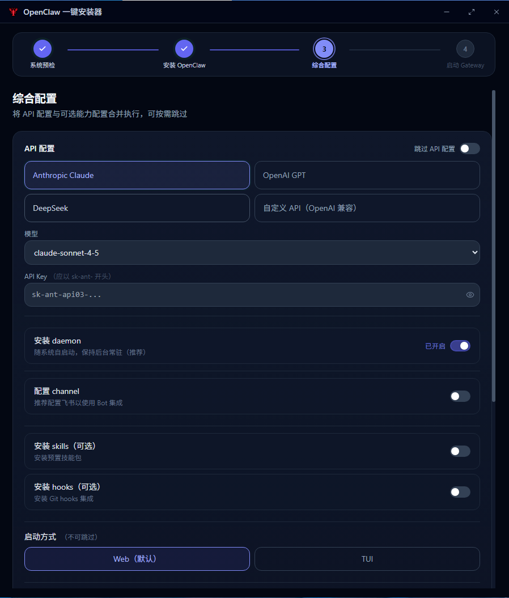
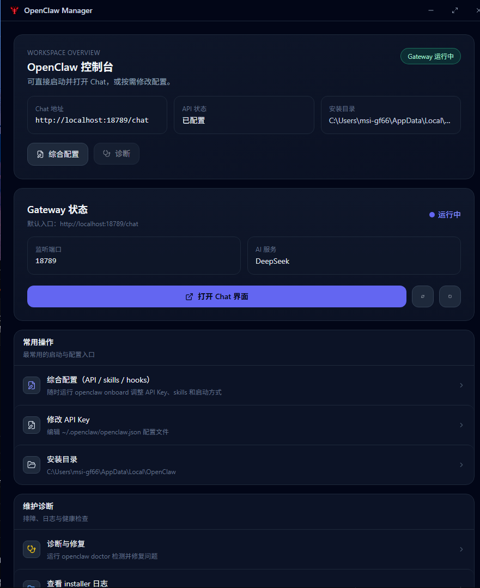
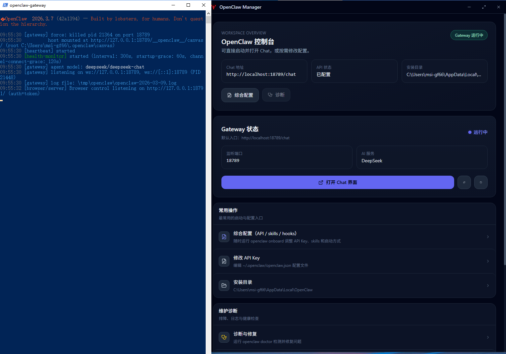
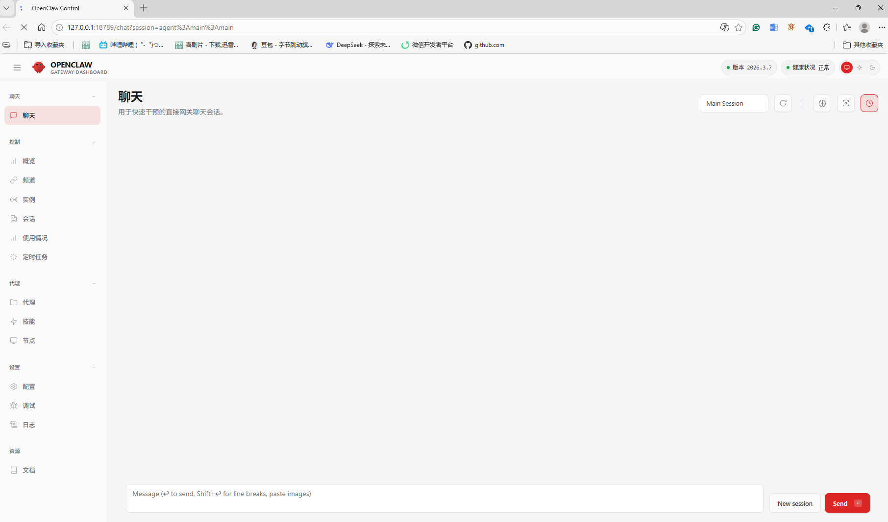

# OpenClaw 一键安装器

OpenClaw 一键安装器是一款桌面应用，帮你快速完成 OpenClaw CLI 的安装、配置和日常管理。


## 能做什么

- **系统环境检测**：自动检查是否满足安装条件（权限、内存等）
- **一键安装 OpenClaw CLI**：自动安装 Node.js、OpenClaw 及依赖
- **API 与飞书配置**：配置 API 密钥、模型，以及飞书机器人（可选）
- **Gateway 服务管理**：启动/停止 Gateway，查看状态与日志

## 首次使用流程

安装器首次启动会按下面顺序引导你完成环境搭建：

```
环境预检 → 安装 OpenClaw → 配置参数 → 启动 Gateway → Chat 页面
```

## 流程指引

### 第一步：环境预检

进行安装前的环境检查，确保本机满足运行条件：

- **管理员权限检查**：安装与配置需要管理员权限，不足时可按提示一键提权
- **内存检查**：检查系统内存是否充足（推荐 ≥8GB）
- **网络联通检查**：验证网络可用，便于后续下载依赖与访问 API


### 第二步：安装 OpenClaw

自动下载并安装 OpenClaw 运行环境与 CLI,安装过程会唤起powershell预览实时进度：
不同用户环节耗时不一,预计5min以内完成安装
- 若未检测到 Node.js，会先安装 Node.js 运行环境（2-3min）
- 安装 OpenClaw CLI 及必要依赖（1-2min）
- 界面会实时显示安装进度与日志




### 第三步：配置参数

在此步骤完成 OpenClaw 的核心配置：

- **飞书信息**：配置飞书机器人（App ID、App Secret 等）
- **模型信息**：选择 API 提供商（Anthropic、OpenAI、DeepSeek 或自定义），填写 API 密钥并验证，选择模型
- **Skills（可以跳过）**：选择或配置需要使用的技能
- **Hooks（可以跳过）**：选择或配置需要使用的技能



### 第四步：等待 Gateway 启动

应用当前配置并启动 OpenClaw Gateway 服务：

- 自动应用已保存的配置
- 启动 Gateway 并检测端口占用
- 校验服务是否正常响应

### 第五步：Chat 启动页面

Gateway 启动成功后，可进入 Chat 页面开始使用：

- 在 Chat 页面与 OpenClaw 对话、调用已配置的模型与技能
- 管理界面中也可随时查看 Gateway 状态、修改配置或查看日志



网关会自动启动，会出现新的powershell弹窗，保留该poewershell弹窗开启，即可确保网关gateway运行


### 第六步：使用OpenClaw页面

进入 Chat 页面使用OpenClaw：

- 可点击下方new开启新的对话



## 日常使用

- 若之前已完成安装与配置，再次打开安装器会直接进入**第五步 Chat 启动页面**。
- 若安装曾中断或配置不完整，安装器会自动识别并从中断步骤或缺失配置处继续。

## 故障排除

| 问题 | 建议 |
|------|------|
| 权限不足 | 使用界面中的「一键提权」，或以管理员身份运行程序 |
| 网络异常 | 检查防火墙与网络连接 |
| 端口冲突 | Gateway 默认端口 18789，若有冲突会自动尝试其他端口 |
| 配置丢失 | 重新打开安装器，按向导补充或重新配置 |

安装器内提供**诊断工具**与**日志查看**，便于排查 OpenClaw 环境与运行问题。

## 版本与许可

- 版本更新说明见 [CHANGELOG.md](./CHANGELOG.md)
- 许可信息见项目中的 LICENSE 文件

## 规划
1、样式优化
2、体验交互优化（loading等待、二次打开检测）
3、skills和hooks库拓展，模型选择拓展。可搜索search
---

*开发者文档（技术栈、构建、状态与路由逻辑等）见 [README_DEVELOPER.md](./README_DEVELOPER.md)。*
